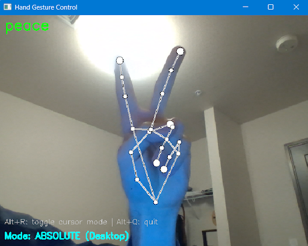

# Hand-Computer-Control-Interface

Control your computer using hand gestures captured by your webcam! This project uses machine learning to recognize hand gestures and translate them into mouse movements, clicks, scrolling, and more.



## Features

-   **Real-time hand tracking** using MediaPipe
-   **Gesture recognition** with a trained neural network
-   **Two control modes:**
    -   **Absolute Mode** (Desktop): Direct cursor positioning for general desktop use
    -   **Relative Mode** (Gaming): Raw mouse input for in-game camera control (e.g., Minecraft)
-   **Cross-platform support**: Works on Windows, macOS, and Linux
-   **Resizable display window** UI overlay window, with feedback showing landmarks and detected gesture
-   **Global hotkeys** to switch control modes and close the program

## Supported Gestures


-   ✊ **Fist**: Stop all actions / neutral state
-   ☝️ **Point** (index finger): Hold left mouse button
-   ✌️ **Peace** (two fingers): Hold right mouse button
-   👍 **Thumbs Up**: Scroll up
-   👎 **Thumbs Down**: Scroll down
-   🖐️ **Five** (open hand): Double left-click

## Requirements

-   **Python 3.12** (required for MediaPipe compatibility)
-   Webcam

## Installation

1. Clone this repository:

    ```bash
    git clone https://github.com/nathancbao/Hand-Computer-Control-Interface.git
    cd Hand-Computer-Control-Interface
    ```

2. Install dependencies:

    ```bash
    pip install -r requirements.txt
    ```

3. If you encounter issues with the keyboard library requiring admin privileges, run your terminal/command prompt as administrator.

## Usage

Run the application:

```bash
python main.py
```

### Controls

-   **Alt+R**: Toggle between Absolute (Desktop) and Relative (Gaming) mode
-   **Alt+Q**: Quit the application

### Tips

-   **Position your hand** in the center of the camera frame for best tracking, not too far away and not too
-   **Adjust window size/position**: The window is resizable/moveable - make it smaller and position it in a corner so you can see it while working
-   **Gaming mode**: Switch to Relative mode (Alt+R) for better camera control in games
-   **Sensitivity**: You can adjust sensitivity, deadzone, and smoothing values in `computer_controller.py`

## Configuration

### Adjusting Mouse Settings

Edit `computer_controller.py` to customize:

**Relative Mode (Gaming):**

-   `SENSITIVITY` (default: 200): Higher = faster camera movement
-   `DEADZONE` (default: 0.05): Higher = less jittery but less responsive
-   `SMOOTHING` (default: 0.3): Lower = smoother, higher = more responsive

**Absolute Mode (Desktop):**

-   `EXPANSION_FACTOR` (default: 1.5): Higher = less hand movement needed to reach screen edges
-   `SMOOTHING` (default: 0.25): Lower = smoother cursor movement
-   `DEADZONE` (default: 2): Minimum pixel movement to register

## Training Your Own Model

The project includes a pre-trained gesture classifier. To train your own:

1. Navigate to the model directory and open `train.ipynb`
2. Collect gesture data using the data collection mode
3. Train the model with your custom gestures
4. Replace `keypoint_model.pth` with your trained model

## Project Structure

```
Hand-Computer-Control-Interface/
├── main.py                  # Main application entry point
├── hand_tracking.py         # Hand detection and landmark extraction
├── gestures.py             # Gesture definitions
├── computer_controller.py  # Mouse and keyboard control logic
├── requirements.txt        # Python dependencies
├── model/
│   ├── keypoint_classifier.py  # Neural network classifier
│   ├── keypoint_model.pth      # Trained model weights
│   ├── train.ipynb             # Training notebook
│   └── dataset/                # Training data
└── README.md
```

## Troubleshooting

**Window spawns too small or in wrong position:**

-   Adjust window size/position in `main.py` (lines with `cv.resizeWindow` and `cv.moveWindow`)

**Mouse movement doesn't work in games:**

-   Make sure you're in Relative mode (press Alt+R)
-   On Windows, install `pywin32` for better compatibility
-   Some games with anti-cheat may block input automation

**Global hotkeys don't work:**

-   The `keyboard` library may require administrator/root privileges
-   Try running the script with elevated permissions

**Camera not detected:**

-   Check if another application is using the webcam
-   Try changing the camera index in `main.py`: `cv.VideoCapture(0)` → `cv.VideoCapture(1)`

## License

This project is open source and available for educational purposes.

## Credits

-   Hand tracking powered by [MediaPipe](https://google.github.io/mediapipe/)
-   Built with OpenCV, PyTorch, and PyAutoGUI
